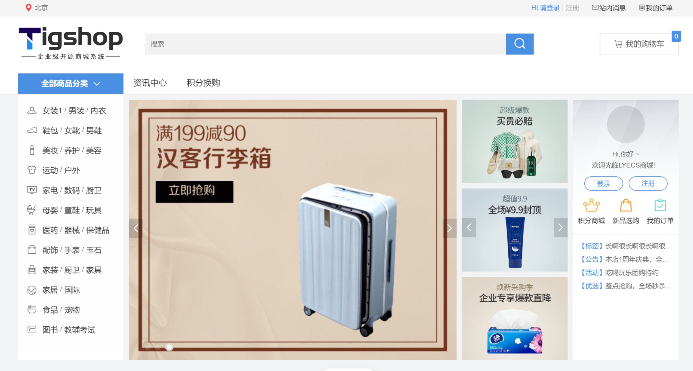
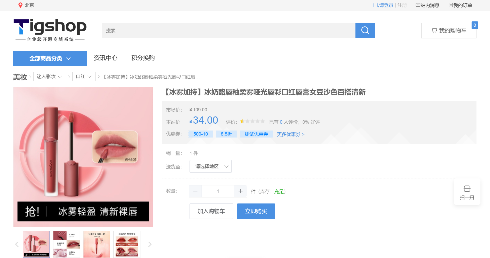
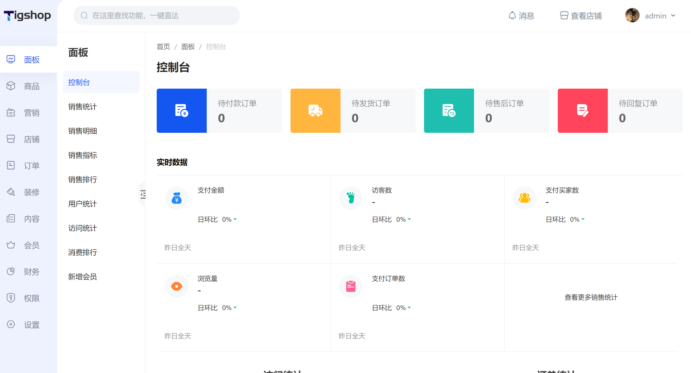
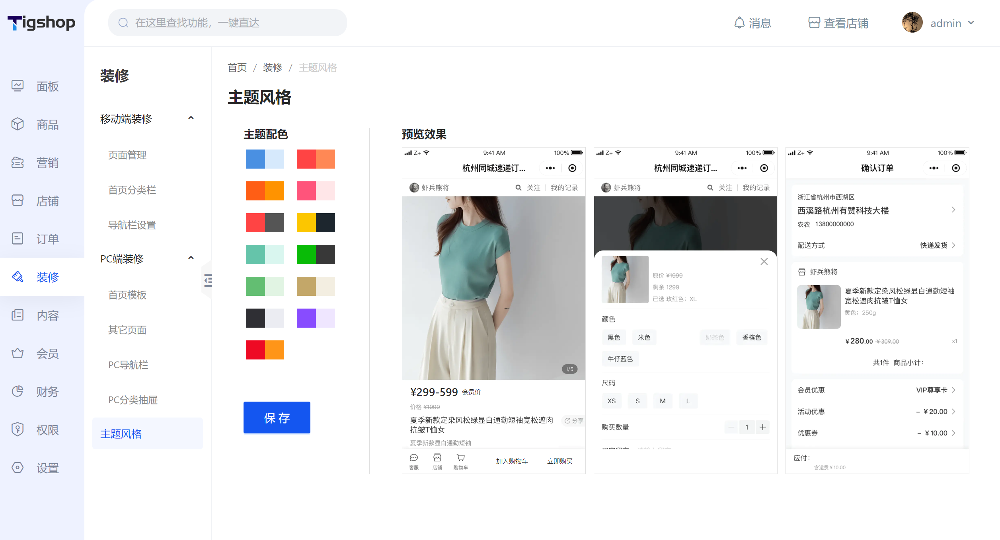

    

TigShop开源商城系统PHP版

    
    
     

####  

[官网](https://www.tigshop.com/) |
[在线体验](https://pcdemo.tigshop.com/) |
[帮助文档](https://www.tigshop.com/) |
[技术社区](https://www.tigshop.com/)

---

### 介绍

TigShop开源商城系统是一款全开源可商用的系统，前后端分离开发，拥抱最新的PHP8+ VUE3 uniapp全新技术架构。

使用说明和常见问题，可参阅下面的说明，如还有疑问，可访问官方社区 https://www.tigshop.com/ 寻求帮助！

Tigshop开源商城PC端前端：[https://github.com/tigshop/tigshop-pc](https://github.com/tigshop/tigshop-pc)

Tigshop开源商城移动前端：[https://github.com/tigshop/tigshop-uniapp](https://github.com/tigshop/tigshop-uniapp)

Tigshop开源商城管理后台前端：[https://github.com/tigshop/tigshop-admin](https://github.com/tigshop/tigshop-admin)

---

#### 平台管理端功能

| 模块 | 功能                                                  |
|----|-----------------------------------------------------| 
| 面板 | 会员统计、订单统计、访问统计、商品销售统计                               |
| 商品 | 商品列表、商品审核、商品分类、商品品牌、商品评论、                           |
| 促销 | 优惠券、秒杀活动、积分商品、余额                                    |
| 店铺 | 店铺管理、店铺审核、店铺结算、店铺对账                                 |
| 订单 | 商品订单、积分订单、订单售后                                      |
| 装修 | 移动端装修、PC端装修、主题风格                                    |
| 内容 | 帮助文章，资讯文章                                           |
| 会员 | 会员列表、会员等级、会员留言、站内信、会员积分                             |
| 财务 | 提现申请、充值管理、余额日志、发票管理、退款管理、交易日志                       |
| 权限 | 权限目录、开发工具、管理员管理、角色管理、操作日志                           |
| 设置 | 系统设置、行政地区管理、OSS管理、联合登陆、支付、物流公司、敏感词、验证码资源、接口设置、客服设置等 |

---

### 技术选型

##### 后端

| 技术项    | 说明             | 
|--------|----------------|
| 基础框架   | thinkphp8.0    | 
| 关系型数据库 | MySQL 5.7+     | 
| 缓存     | Redis +file    | 
| 安全框架   | JWT            | 
| 定时任务   | crontab        | 
| 负载均衡   | Nginx          | 
| 队列     | redis+database | 
| 日志处理   | Log            | 

##### 前端-PC端

| 说明    | 框架                        | 说明   | 框架    |
|-------|---------------------------|------|-------|
| 构建工具  | vite4                     | 基础框架 | Vue3  |
| 基础UI库 | elem-plus                 | 网络请求 | axios |
| 其他    | ts + nuxt3 + pinia + less |

##### 前端-移动端

| 说明     | 架构                  | 说明   | 架构           |
|--------|---------------------|------|--------------|
| 基础UI库  | uView-plus & uni-ui | 基础框架 | uni-app vue3 |
| CSS预处理 | scss                |      |              |

### 演示地址

管理后台： http://admindemo.tigshop.com

账号：123123 密码：123123

H5端：http://demo.tigshop.com/ （移动端打开）

PC端：http://demo.tigshop.com/ （电脑端打开）

---

### 部署教程

ps: 如果你不清楚如何启动我们的商城，请仔细阅wiki当中的文档

https://tigshop.com/
---

---

### 商城功能展示

---

### 版权须知

Apache License 2.0 许可的主要内容包括：

1. 授权：允许任何人以任何目的使用、复制、修改和分发该软件。

2. 版权声明：要求在软件和相关文档中包含原始版权声明和许可证声明。

3. 保证免责：表明该软件是按现状提供的，没有任何明示或暗示的担保或保证。作者不承担任何赔偿责任。

4. 贡献者授权：要求所有贡献者授予 Apache 软件基金会永久性的、免费的、不可撤销的许可，以使用、复制、修改和分发其贡献。

5. 专利许可：为了保护使用该软件的用户，该许可要求贡献者授权任何必要的专利许可，以便将其用于 Apache 软件基金会的项目。

Apache License 2.0 是一种宽松的开源许可，允许人们自由使用、修改和分发软件。

---

